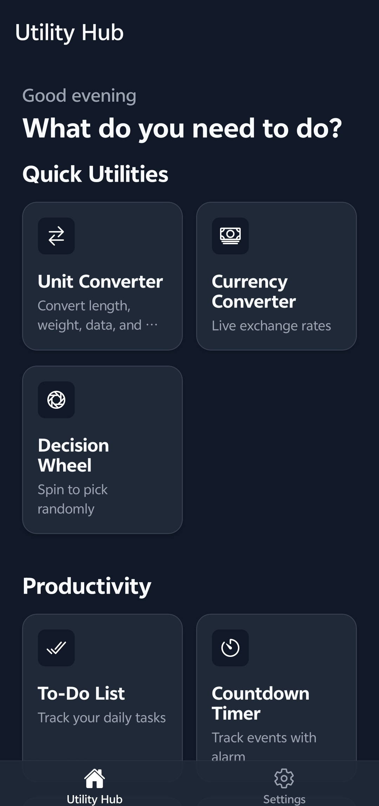
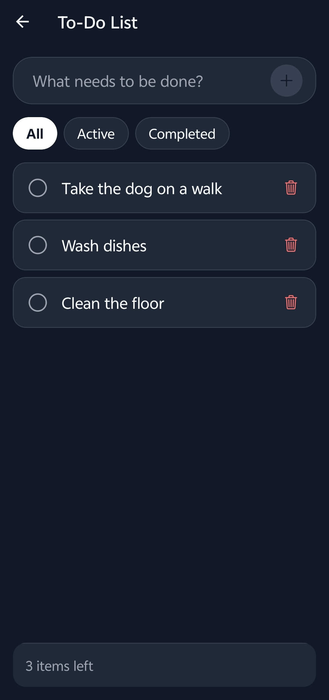
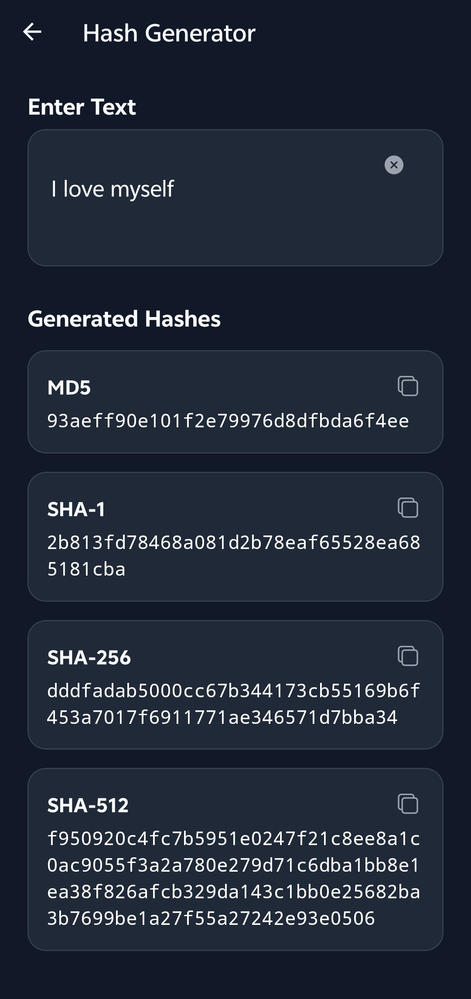

# Utility Hub

Utility Hub is a comprehensive, privacy-first mobile toolkit designed to bring essential productivity, image, and document utilities directly to your device. Built with a focus on local-first processing, it ensures your data remains secure while providing a sleek, modern, and highly responsive user interface with dynamic light and dark themes.

## Screenshots

<div style="display: flex; gap: 10px;">
  
  
  
</div>

## Features

Utility Hub includes a versatile collection of tools categorized for your convenience:

- **Quick Utilities**: Unit Converter, Currency Converter, Decision Wheel, Random Generator, Color Picker
- **Productivity**: Daily Planner, Quick Notes., Countdown Timer, To-Do List
- **Images**: Image Compressor, Background Eraser, Passport Photo Maker, Image Resizer, EXIF Metadata Viewer
- **Documents**: Document Scanner, PDF Compressor, Image to Text (OCR), Text-to-Speech
- **Tools**: Text Encoder/Decoder, File Batch Renamer, Encryption Tool, QR Generator, Password Generator, Hash Generator, Base Converter.

*Note: While the vast majority of tools operate 100% offline, specific advanced AI features (like Background Eraser, OCR, and PDF Compressor) securely connect to trusted third-party APIs (Remove.bg, OCR.space, ConvertAPI) using your own API keys. No personal data is tracked or retained.*

---

## Local Offline Build Instructions

You can compile and build the Utility Hub app directly on your local machine completely offline, without needing to upload the project to Expo Application Services (EAS).

### Prerequisites

To build the project locally, ensure you have the following installed on your system:
- **[Node.js](https://nodejs.org/)** (v18 or newer recommended)
- **[Java Development Kit (JDK 17)](https://adoptium.net/)** (Required for compiling Android)
- **[Android Studio & Android SDK](https://developer.android.com/studio)** (Ensure `ANDROID_HOME` environment variable is set and platform tools are installed)
- **[Xcode](https://developer.apple.com/xcode/) & CocoaPods** (Required for compiling iOS, macOS only)

### Build Steps
0. **Clone the repo**
   ```bash
   git clone https://github.com/knoxenowo/Utility-tool.git
   ```
1. **Install Dependencies**
   Navigate to the project root and install the required Node modules:
   ```bash
   npm install
   ```

2. **Generate Native Projects**
   Utility Hub is built using Expo Router. To build entirely offline, you must first generate the underlying native `android` and `ios` project directories:
   ```bash
   npx expo prebuild
   ```

3. **Build for Android (APK)**
   Compile the Android app using Gradle:
   ```bash
   cd android
   ./gradlew assembleRelease
   ```
   *The successfully compiled APK will be output to: `android/app/build/outputs/apk/release/app-release.apk`*

4. **Build for iOS**
   Compile the iOS app using CocoaPods and Xcode:
   ```bash
   cd ios
   pod install
   cd ..
   npx expo run:ios --configuration Release
   ```
   *Alternatively, you can open `ios/uts.xcworkspace` in Xcode to manually archive and distribute the application.*
